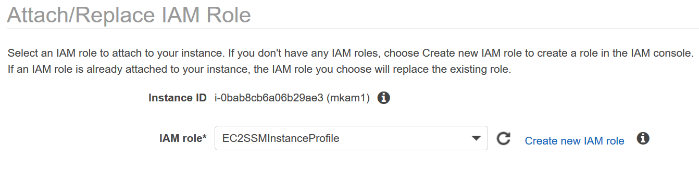
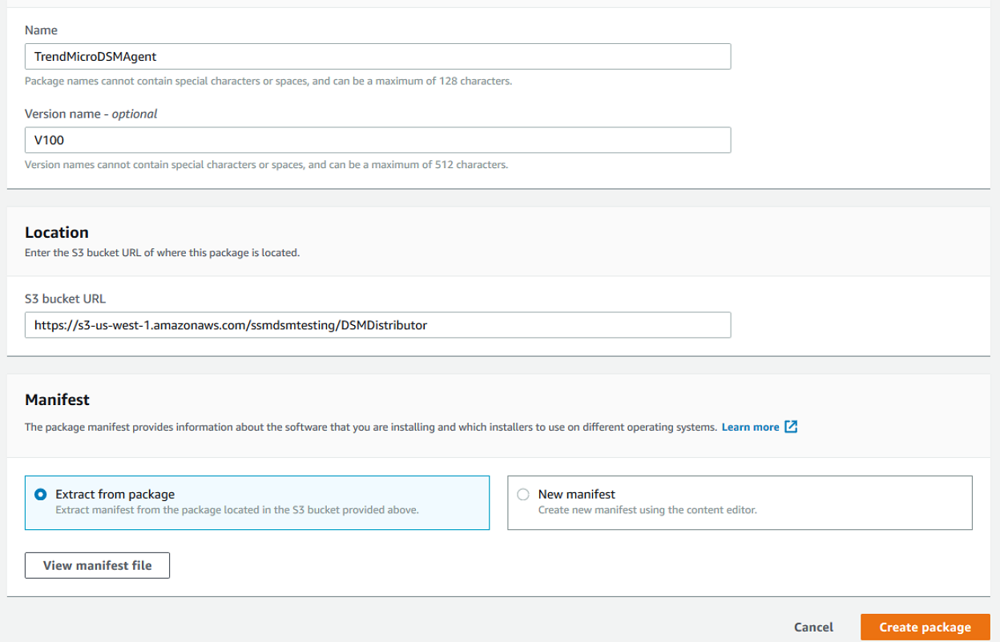
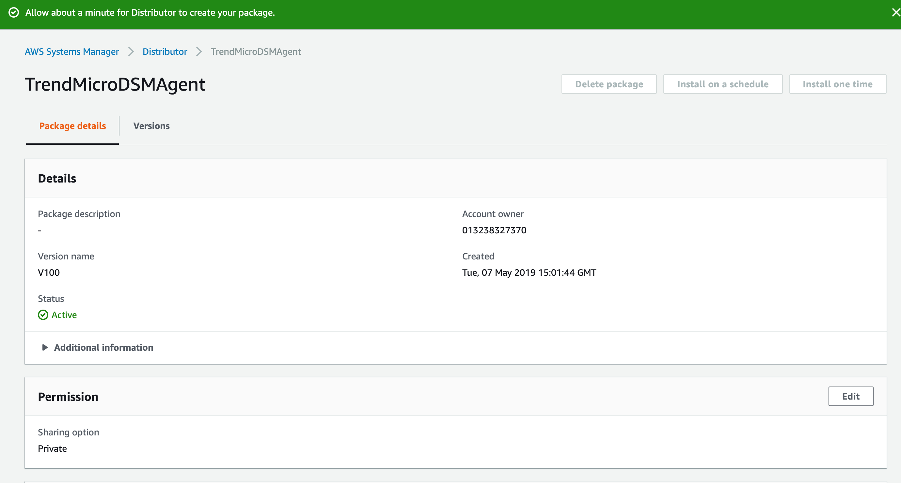
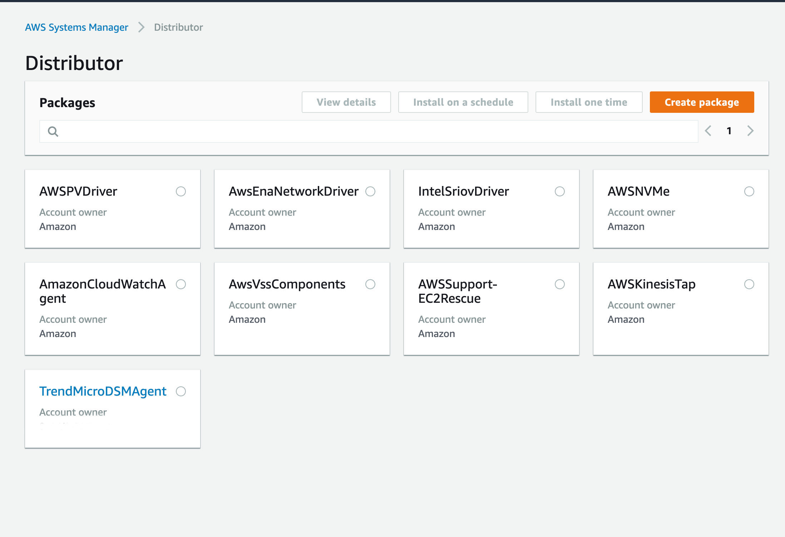
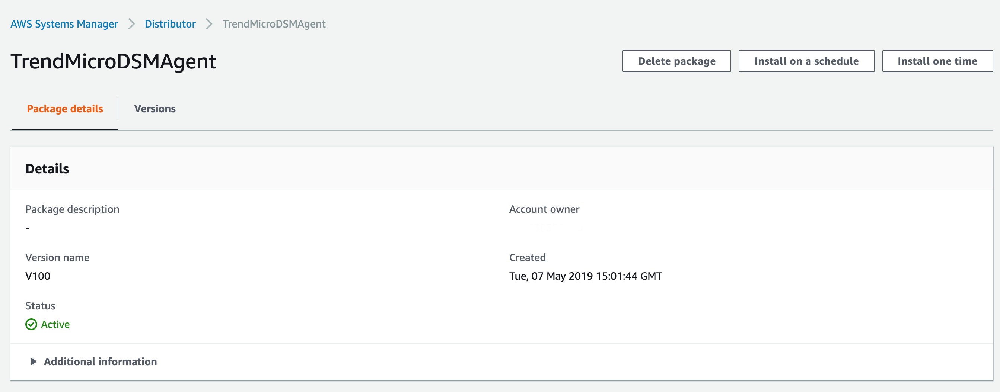

# Deploy the DS Agent with SSM

> AWS Systems Manager Distributor is a feature that you can use to
> securely store and distribute software packages, such as software
> agents, in your accounts. Distributor integrates with existing Systems
> Manager features to simplify and scale the package distribution,
> installation, and update process.
>
> These instructions will walk you through how to use AWS Systems Manager
> Distributor to deploy the Trend Micro Deep Security Agent. We will
> assume you have a version of Deep Security Manager running and it is
> accessible to the instances running in AWS. If not, you can deploy the
> [Deep Security
> Manager](https://aws.amazon.com/marketplace/pp/B01AVYHVHO?qid=1557771737718&sr=0-2&ref_=srh_res_product_title)
> using our quick start on the AWS Marketplace.
>
> This will create an AWS IAM Instance Profile for the
> EC2 instances that we want to deploy the Deep Security Agent on. We
> will use a CloudFormation Template to create the instance profile,
> along with two SSM Parameters for the Deep Security Manager Hostname.
> The CFT must be deployed in the same region as your instances because
> the SSM Parameters and Distributor are regional entities.

Prerequisites:
==============

> **EC2 Instances** -- Instances you want to install the agent on. See
> Support Operating Systems for SSM.
>
> **AWS CLI** -- this is normally installed by default on most Windows
> and Amazon Linux AMIs
>
> **Systems Manager Agent** -- latest version -- This is installed by
> default on most Windows and Amazon Linux AMIs but you will need to
> upgrade to the latest version to ensure compatibility

Create the Instance Profile and SSM Parameters via CloudFormation
=================================================================

1.  Clone repo: <https://github.com/marykay25/SSM>

2.  Go to: <https://console.aws.amazon.com/cloudformation/>

> 

3.  Click **Create Stack**.

4.  Click **Choose File**.

> 

5.  Select the file **dsm\_ssm.template** from the repo.

> 

6.  Click **Next**.

7.  Enter **DSMSSM** for the **Stack Name**.

8.  To fill out the template, reference the DSM deployment script by logging into your DSM, then clicking on **Support** at the top right and then select **Deployment Scripts**.
       - **DSMActivation**, enter the Activation URL from the DSM deployment script including the dsm prefix and trailing "/"
	   - **DSMManage**, enter in the DSM Manager URL from deployment script including the https prefix and port
	   - **TenantID**, Required only for DSaaS or Multi-Tenant Deployments, otherwise leave NON
       - **Token**, Required only for DSaaS or Multi-Tenant Deployments, otherwise leave NONE

> 

9.  Click **Next**.

10. Enter **Name** under **Key** and **DSM SSM** under
    **Value**.

11. Click **Next**.

> 

12. Check the box next to: **I acknowledge that AWS CloudFormation might
    create IAM resources with custom names.**

> 

13. Click **Create**.

> 
>

14. Wait for the CloudFormation to complete.

Attach the Instance Profile to EC2 Instances
============================================

1.  Go to the EC2 Console.

2.   Select the instance you want to add to IAM Role.

3.  Select **EC2SSMInstanceProfile.**

    

4.  Click **Apply.**

5.  Repeat for any other additional instances.

Building the Distributor Package
================================

1.  Go to the S3 Console: <https://console.aws.amazon.com/s3/>

2.  Select a bucket or create a new one.

3.  Click the bucket name.

4.  Click **Create folder**. Name the folder
    **DSMDistributor.**

5.  Click **Save.**

6.  Go into the folder **DSMDistributor.**

    

7.  Click **Upload**. Add the **manifest.json**,
    **TrendMicro\_Windows.zip**, and **TrendMicro\_Linux.zip.**

    

8.  Click **Upload.**

> 

9.  Now click the **manifest.json** file and copy the link under
    **Object URL** up to the last '/'.

    

10. Go to System Manager:
    <https://console.aws.amazon.com/systems-manager/>

> 

11. Click **Distributor.**

    

12. Click **Create Package.**

13. Enter a **Name.**

14. Enter a **Version name.**

15. Paste the URL from step 10 into **S3 Bucket Location.**

16. Select **Extract from package.**

> 

17. Click **Create Package.**

> 

18. Wait a minute.

19. On the left side, click
    **Distributor**.

20. Click **TrendMicroDSMAgent** or the name you gave for the package.

> 

21. Click **Install one time.**

> 

22. Scroll down to **Targets.**

23. Select some **Target Instances** to install the agent onto.

-   The shortest collection interval is every 30 minutes, but can be
    longer. For more information:
    <https://docs.aws.amazon.com/systems-manager/latest/userguide/systems-manager-inventory.html>

> 

24. Scroll to **Output options.**

25. Uncheck **Enable writing to an S3 bucket.**

> 

26. Click **Run.**

> 

27. After a few minutes, the command will succeed.

> 

28. Now you can log into the Deep Security Manager console to see the
    new instances.

> 
